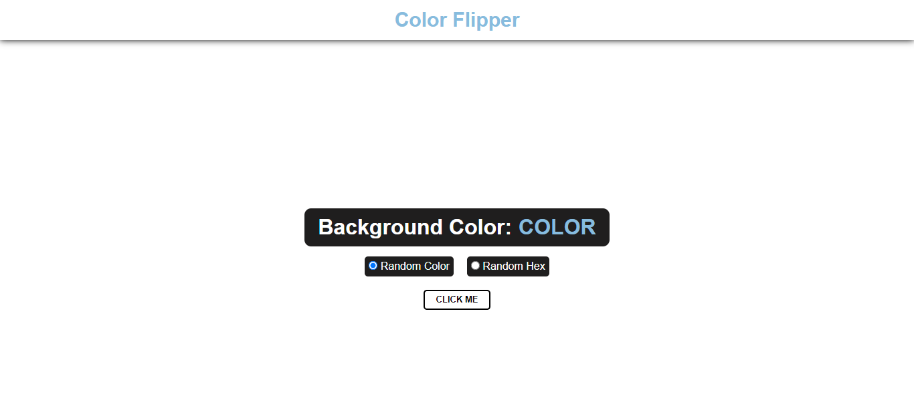

# Color Flipper

### Status: Finalizado.

 

> ⚠️Este é um projeto baseado no Tutorial Color Flipper de John Smilga, no qual foi realizado algumas modificações de funcionalidade por mim.
> Clique no [link](https://www.youtube.com/watch?v=3PHXvlpOkf4&t=421s) para verificar o projeto no qual utilizei como referência.

 

O Projeto Color Flipper tem como principal função, gerar cores de fundo de maneira aleatória para seus usuários.

**Random Color** - Tem a função de Gerar cores Aleatórias dentro de uma lista pré estabelecida.

**Random Hex** - Tem a função de gerar Cores aleatórias em código hexadecimal.

Para este projeto foi utilizado as seguintes tecnologias:

- HTML5
- CSS3
- JavaScript.

Para verificar o projeto em produção, acesse este [link](https://gtm35.github.io/color-flipper/).

### Versão Desktop:

### Versão Mobile:

